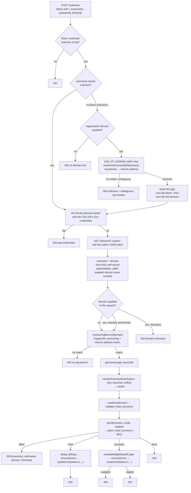

# Architecture

Why this Worker is shaped the way it is: the pipeline, the decision table, the eligibility model, the
topology transition, and the module boundary.

## Module boundaries

| File | Role |
|---|---|
| `src/worker.ts` | HTTP entrypoint: routing, Basic-auth gate, request parsing, fail-closed error handling. |
| `src/config.ts` | Parses `Env` (Worker vars/secrets) into a validated `Config`. Throws `ConfigError` on any missing/malformed value — the caller turns that into a 403, never a 500. |
| `src/clients.ts` | Builds the real dependency set (`AuthorizeDeps`) from `Config` — NS OAuth client, the NS self-record reader, the Ringotel read/write clients. |
| `src/orgBranch.ts` | Resolves a NetSapiens domain to a Ringotel `{orgid, branchid, rtDomain}` via the mapping engine, then confirms it authoritatively against branch `address`. `rtDomain` (`branch.domain ?? org.domain`) is the Ringotel org domain returned in the success response. |
| `src/decide.ts` | Pure function: `(verdict, mode, eligible) → {action, reason}`. The verdict × mode table below, as code. |
| `src/authorize.ts` | The pipeline itself — orchestrates auth, resolution, classification, decision, and (for heal/provision) the write sequence. |

Everything under `src/` is Worker-specific composition and policy. The primitives it calls —
`resolveCanonicalUser`, `resolveOrg`, the NS OAuth password-grant client, `evaluateEligibility`, and both
Ringotel/NetSapiens read+write clients — live in the two published libraries, `@dszp/ringotel-lib` and
`@dszp/netsapiens-lib`.

## The pipeline

Steps, matching [`src/authorize.ts`](./src/authorize.ts):

1. **Gate** — constant-time compare of the Basic credential. Fail → 401.
2. **Verify NS credentials** — NetSapiens OAuth password-grant using the *end user's own*
   username/password (signed with the master key, `NS_OAUTH_CLIENT_ID`/`NS_OAUTH_CLIENT_SECRET`). A
   4xx grant failure denies (403); a 5xx/network failure propagates and is caught by the top-level
   fail-closed handler (also 403).
3. **Identity from the NS self endpoint** — `GET /domains/~/users/~`, called **with the user's own
   freshly-minted token**, never an admin/API-key identity. This is the sole source of truth for
   extension and domain. `input.domain` — the `domain` field in the request body — is **optional**: in
   practice, Ringotel's real SSO webhook sends only `username` + `password` (its SSO service
   definition's `$domain$` placeholder resolves to nothing at send time — a property of THAT
   integration's configuration, not of Ringotel generally). When `domain` IS present it's
   used for the cross-tenant check in the next step; when it's absent, that check is skipped and logged
   (`domainCheck: 'skipped-not-supplied'`) — the self-derived domain still governs everything downstream.
   Note the `<ext>@<domain>` shape of `username` normally carries only the *short* NetSapiens domain
   label (no territory suffix), so it is never itself a substitute for `self.domain`.
4. **Resolve org/branch** — `resolveOrg(firstLabel, orgs, mapping)` picks a candidate Ringotel org, then
   the result is **confirmed authoritatively** by finding a branch whose `address` equals the full NS
   domain — the same key Ringotel binds an SSO login by. No match at either step → 403.
5. **Read + classify** — `getUsers(orgid, branchid)` then `resolveCanonicalUser(users, {ext, branchid,
   suffix})` produces one of four verdicts (below).
6. **Decide** — `modeFor(domain, healDomains, provisionDomains)` picks the domain's mode (provision beats
   heal beats validate); `decide(verdict, mode, eligible)` picks the action. `domain` here is always the
   self-derived, full NetSapiens domain (with territory suffix), so `SSO_HEAL_DOMAINS`/
   `SSO_PROVISION_DOMAINS` must be configured with that full form — not the short label that appears in
   `username`. This same NetSapiens domain also drives `resolveOrgBranch`, eligibility's `ctx.domain`,
   the cross-tenant check, and `createUser`'s `domain` field (the NS domain the Ringotel user's SIP
   identity belongs to).
7. **Act** — `allow` returns immediately; `heal`/`provision` write inline (device + SIP password +
   active Ringotel user) **before** responding, then return the same success shape. `deny` → 403.
8. **Respond and log** — `{extension, authname, domain}` / 403. **`domain` in the 200 body is the
   RINGOTEL org domain** (`resolveOrgBranch`'s `rtDomain`: `branch.domain ?? org.domain`), not the
   NetSapiens domain used in every step above — it's the value Ringotel's SSO `response_map` consumes to
   bind the session. If neither the branch nor the org carries a Ringotel domain, the field falls back to
   the NetSapiens domain (logged as `rtDomainFallback: true`) rather than going out empty. The structured
   log line carries both — `domain` (NS) and `rtDomain` (Ringotel) — plus verdict, mode, action, ext, and
   outcome, so refusals, heals, and creations are all observable.

## The three interventions: provision, heal, repair

They are easy to confuse because all three end with a working user. They differ in **what is wrong**,
**which system is repaired**, and **when they run**.

| | what's wrong | fixes | when |
|---|---|---|---|
| **provision** | no Ringotel record exists at this extension | Ringotel (creates) | during the request |
| **heal** | a Ringotel record exists but isn't usable | Ringotel (repairs in place) | during the request |
| **repair** | the Ringotel record is fine; its **NetSapiens** device is missing | NetSapiens (recreates) + re-syncs the credential | after the response |

In one line: **provision** = the record is absent, **heal** = the record is present but wrong,
**repair** = the record is right but the thing underneath it vanished.

### provision — nothing exists yet

Triggered by verdict `none` on a provision-enabled domain, and it is the only path gated by
**eligibility**: system/service users and non-3-4-digit extensions are never auto-created, and soft rules
(shared-mailbox name patterns, per-domain exclusions) can exclude more. This is the only intervention
that can *increase what you are billed for*, which is why it is gated hardest. Note the email precondition is
not a judgement about who deserves an app — it exists so activation has somewhere to send credentials, and
`SSO_REQUIRE_EMAIL` defaults to enforcing it only when an email will actually be sent.

The waiver is expressed *to* the shared engine rather than applied after it: `SSO_REQUIRE_EMAIL` and
`SSO_SEND_ACTIVATION_EMAIL` decide whether to pass `EligContext.emailNotRequired`, and the library returns
`EligResult.emailWaived` when it actually waived. This matters because the same predicate runs in other
consumers of that library — expressing the rule as an input keeps one implementation deciding, so identical
inputs cannot produce different verdicts in different places. It stays deliberately narrow: only the email
check is waived, so a precondition added to the library later is not silently bypassed along with it.

*Technically:* ensure the NetSapiens softphone device `<ext><suffix>` exists (create if absent) and read
its generated SIP registration password, then `createUser` in Ringotel — `username`/`authname` set to the
device name, that SIP password, `status: 1`, plus the display name and email taken from the NetSapiens
self-record so the directory entry is correct from the start.

### heal — it exists, but it can't work

Triggered by verdict `inactive-exists` (a deactivated record) or `ambiguous` (more than one record at the
extension). Heal reactivates the **canonical** record — the one already carrying the SIP identity
`<ext><suffix>` — and removes the others.

*Technically:* the same device step as provision, then `updateUser` on the canonical record setting
`status: 1` along with `username`/`authname`/`password` and the current NetSapiens name and email; then a
best-effort `deleteUser` for each non-canonical sibling. **Order matters and is deliberate:** the
canonical is activated *first*, then siblings are removed. Doing it the other way opens a window where an
SSO bind can land on a record that is about to disappear, which permanently strands the extension in a
state only the vendor can clear.

### repair — the Ringotel side is healthy, NetSapiens drifted

Triggered on an `allow` — a login that needed no Ringotel change at all — when the backing NetSapiens
device has been deleted underneath a still-active Ringotel user. Without it the user "signs in"
successfully and then cannot register: the record looks perfect from Ringotel's side, so nothing else in
this pipeline would ever notice.

*Technically:* read the user's NetSapiens devices; if `<ext><suffix>` is absent, recreate it and push the
newly minted SIP password to Ringotel with `updateUser({ password })` — **both or neither**, since a new
device whose password Ringotel never received is worse than a missing one. It refuses to act if the
Ringotel record's `authname` doesn't already match the expected device name, because then there is no
unambiguous correct device and a wrong write can strand the extension. See "Post-response repair" below
for why it runs after the response rather than inline.

### Which system each one writes to

Worth holding onto, because it explains the allowlists: **provision and heal write to Ringotel**
(creating or activating a billable user), while **repair writes to NetSapiens** (recreating a device) and
only pushes a credential to Ringotel. That is why they are gated separately —
`SSO_PROVISION_DOMAINS` / `SSO_HEAL_DOMAINS` / `SSO_REPAIR_DOMAINS`, each with its own blocklist.

## Verdict × mode

| verdict | `validate` (default) | `heal` (opt-in) | `provision` (opt-in) |
|---|---|---|---|
| `active` — exactly one active (`status:1`), SIP-linked record at the extension | allow | allow | allow |
| `inactive-exists` — a record exists but isn't active | deny (403) | reactivate → allow | reactivate → allow |
| `none` — no record at the extension | deny (403) | deny (403) | eligibility gate → create+activate → allow, else deny |
| `ambiguous` — more than one record at the extension | deny (403) | dedup siblings → reactivate canonical → allow | dedup siblings → reactivate canonical → allow |

Eligibility (`evaluateEligibility`, from `@dszp/netsapiens-lib`) is only consulted for the `none` +
`provision` cell — it gates *creation*, never reactivation or dedup. It's a HARD/SOFT rule engine: system
users and non-3–4-digit extensions are never auto-created (hard); shared-mailbox name patterns, missing
devices, and per-domain custom lists are soft-excludable and reseller-overridable per domain. A third tier,
**precondition**, covers the requirement for an email address — present because activation traditionally
emails the credentials. Since this Worker suppresses that email by default, `SSO_REQUIRE_EMAIL`
(`auto` | `always` | `never`) ties the requirement to whether an email is actually being sent: `auto`
waives it when nothing will be mailed. The waiver is narrow by construction — it matches the blank address
specifically, so hard and soft exclusions are never rescued along with it.

## The activation email

Ringotel sends a credentials email (a new app password, plus a QR code) when a write carries **both**
`status: 1` and an `email` field. Every `heal` and `provision` write here does exactly that, because it
also syncs the NetSapiens name and email into the Ringotel directory entry so the record stays accurate.

That email is **off by default** (`SSO_SEND_ACTIVATION_EMAIL`, which drives Ringotel's `noemail` flag
inverted). The reasoning: a user who reached this Worker did so by authenticating with their NetSapiens
credentials through the app's SSO flow — they are already signed in, and the app password in that email
is one they will never type. Deployments where users also sign in directly, or where the emailed QR is
the intended onboarding path, can turn it on.

Note this does not strand anyone who *needs* the email: a user who cannot sign into NetSapiens at all
(no portal access, or no password set) cannot complete SSO in the first place, so they never reach this
code path — they are activated through some other surface, which makes its own choice about emailing.

## Post-response repair

An `allow` writes nothing during the request — which means it cannot notice that the softphone device
backing the user's SIP registration has been deleted upstream. The record looks healthy, the login
succeeds, and the client then fails to register.

When the domain is listed in `SSO_REPAIR_DOMAINS` (default: empty, off), the pipeline attaches a
`repair` descriptor to a successful `allow` and the Worker hands it to `ctx.waitUntil()` **after** the
response has been sent. The check adds no latency to the login and cannot change its outcome; because a
login is precisely when working credentials are about to be needed, the repair lands in time for the
client's next registration attempt.

**The trade-off, stated honestly:** because the repair runs after the response, there is a brief window
where the login has succeeded but the device does not yet exist, so an inbound call arriving in that
instant could fail. Measured on a live deployment, the device was recreated *and* registered within five
seconds of the login, with no user action — so the window is small and self-correcting. Running the check
inline instead was rejected deliberately: it would add an upstream read to *every* login on a repair-enabled
domain (there is no bulk device read, and no cheap pre-filter — the vendor's own trunk-state field is not
usable at login time, since the app has not connected yet), and it would let a slow or failing upstream
turn housekeeping into a failed authentication. The current shape guarantees repair can never cost anyone
a login. If that window ever proves to matter, the fix is a per-domain flag to run it inline — not a
redesign.

It recreates the missing `<ext><suffix>` device and pushes the newly minted SIP password to Ringotel as
one unit — half of that repair would leave the record definitively stale rather than merely broken. It
refuses to act when the Ringotel record's `authname` does not match the expected device name, because
that record has no unambiguous correct device and a wrong write can strand the extension permanently.
Every outcome is logged as `{"housekeeping":"device-check","result":…}` — work in `waitUntil` is
invisible to the caller, so an unlogged failure would be undetectable.

**Known residual state, accepted rather than fixed:** if `createDevice` succeeds but the subsequent
`rt.updateUser(...)` (pushing the new SIP password to Ringotel) then throws, the device now exists
upstream with a password Ringotel never received. This is at-least-once behaviour, not transactional,
and it is currently self-masking: every later login sees the device present (`getDevices` finds it) and
reports `result: 'ok'` forever, because the check is existence-only — there is no password-freshness
comparison. The only way to discover this state today is a human reading the structured logs for a
`{"housekeeping":"device-check","result":"error", ...}` line (the `catch` in `runDeviceRepair`) from the
run where `updateUser` failed; nothing re-surfaces it afterward.

**Two concurrency notes, both low-probability and neither redesigned around.** Two simultaneous logins
for the same user on a repair domain can both pass the existence check and both create the device; if the
platform treats that as an upsert and re-mints the password, the slower task can push a now-stale
credential *after* the faster one — leaving a wrong password that the existence-only check then reports as
`ok` indefinitely, the same self-masking state described above but reachable without any error line.
Similarly, two simultaneous provisions can create duplicate records; that one self-corrects, since the
next login classifies the extension as `ambiguous` and heals it.

## The boundary: the Worker sequences primitives, it doesn't reinvent them

Every piece of provisioning *logic* — what makes a Ringotel record canonical, how to resolve an NS domain
to a Ringotel org/branch, what makes an NS user eligible for auto-creation, how to mint an NS token — is a
tested, pure (or offline-testable) function in one of the two published libraries. `src/authorize.ts`
only **sequences** those calls and applies the verdict × mode table above; it holds no independent
business rule about what a "clean" user looks like. This is a deliberate constraint, not an accident: it's
what keeps this Worker's decisions from drifting out of sync with any other consumer of the same
libraries.

## Security note: never trust the caller's domain

`input.domain` — the `domain` field in the request body — is **optional and never used to authorize
anything**. In the integration this Worker was developed against, Ringotel sends only `username` +
`password` — that integration's service definition has a `$domain$` placeholder which resolves to
nothing at send time. **That is one configuration, not a universal contract:** the request template is
set per integration by Ringotel support, so another deployment may well receive a populated `domain`.
The Worker works either way. **When Ringotel does send it, the value is Ringotel's own ORGANIZATION
domain** — Ringotel has no way to know your NetSapiens domain — and it is used for exactly two purposes,
neither of which is authorization:

1. **A lookup key, before authentication.** A `username` of a bare extension is not a username until a
   tenant is known, so the organization domain is resolved back to a NetSapiens domain and the login is
   built from that. This is the only step that reads Ringotel before a credential is checked. It reads
   only; it creates nothing; and its output decides *which credentials are verified*, not who the caller
   is. A wrong or hostile value cannot authenticate anyone — at most it sends the password check at some
   other username, which still requires that account's own password to succeed, and the guard below then
   compares the outcome against what was claimed. Identity still comes from the self-record afterwards,
   exactly as before.
   A bare extension with no organization domain is refused outright, and an organization domain that
   answers for more than one branch address is refused rather than resolved to a guess: picking one
   would route a login into a tenant the caller never named.
2. **A cross-tenant sanity check, after authentication.** The claim must name the tenant the
   authenticated user actually belongs to — as its Ringotel organization domain, the full NetSapiens
   domain, or that domain's first label. Anything else is `domain-mismatch`, refused before any write and
   before any Ringotel user is read. Where the claim was already resolved to a NetSapiens domain and the
   credentials proved to belong to that same domain, the check is settled by that fact
   (`domainCheck: 'ok-resolved'`) rather than by comparing spellings.

When `domain` is absent, the check is simply skipped (recorded in the structured log as
`domainCheck: 'skipped-not-supplied'`, vs `'ok'` / `'ok-rt'` / `'ok-resolved'` when it ran) — identity was
never sourced from it either way. Every downstream lookup — org/branch resolution, `getUsers`, eligibility,
mode selection — uses `self.domain`, the value NetSapiens authoritatively attached to the credential that
was just verified. A caller cannot get org/branch resolution, user classification, or a write to run
against a domain other than the one their own verified credentials belong to, no matter what the request
body claims (or omits).

Two more fail-closed properties worth naming:

- **A misconfigured Worker fails closed, not open.** `parseConfig` throwing is caught at the top of
  `fetch()` and turned into a 403 — a broken deploy denies every login rather than silently trusting
  an empty write identity or an unset Basic credential.
- **Write access is least-privilege by construction.** The identity lookup (`GET
  /domains/~/users/~`) always uses the *caller's own* token, minted from *their own* credentials — never
  the admin/API-key write identity, which is only ever minted (and only when needed) inside the
  `heal`/`provision` branches.
